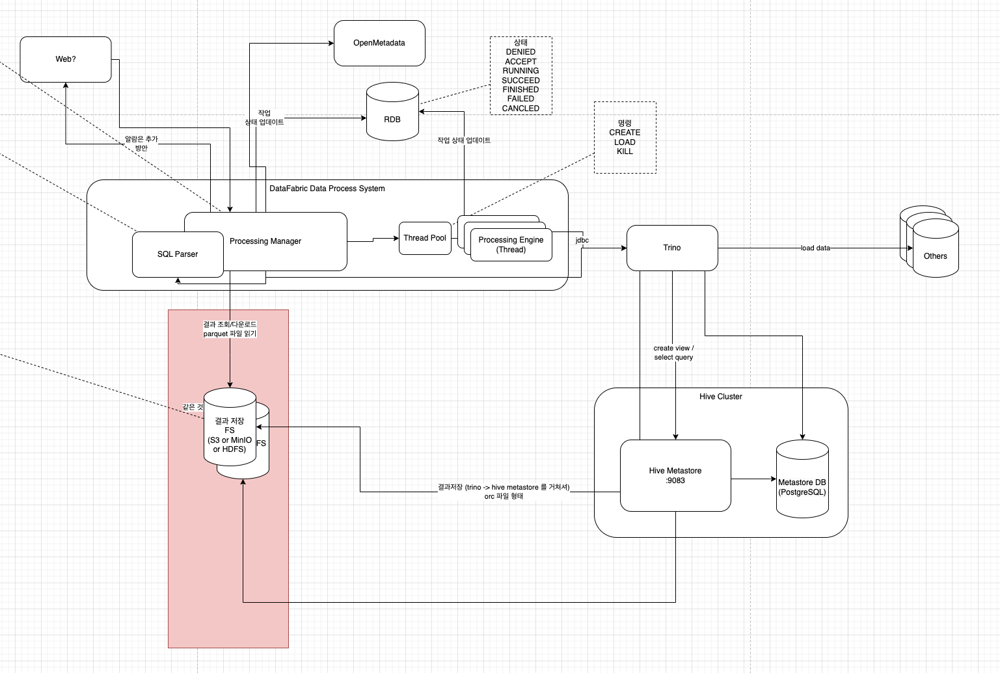
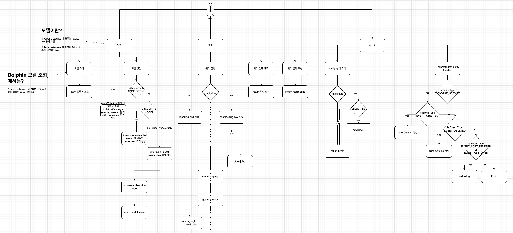
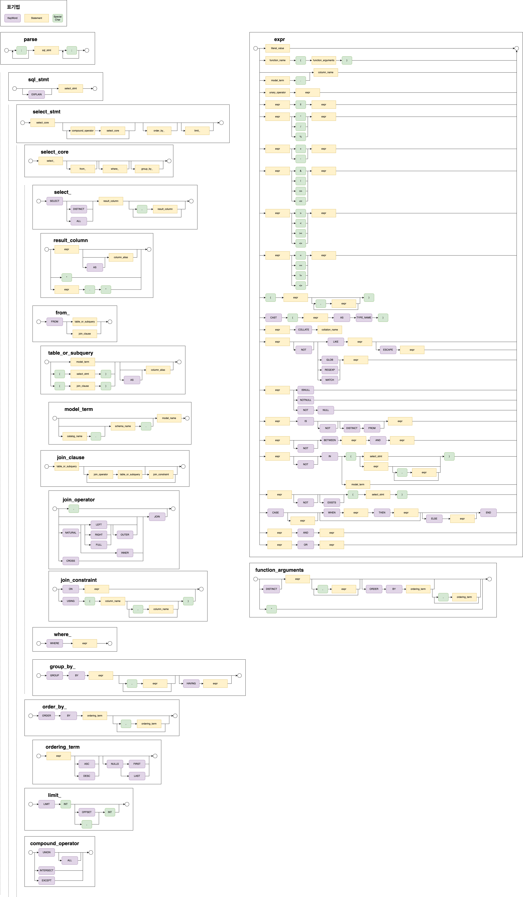

# Dolphin Project

Data Operations and Processing with Logically Integrated High-performance INtegration

## Tools

- Gradle 8.2 (Kotlin)
- Java 21
- Spring Boot 3.3.0
    - spark 와 spring boot 3.x 간 dependency 문제가 있음
        - spark 대신 trino 사용 시 spring boot 3.x 버전 사용 가능
    - spring-boot-starter-data-jpa
    - spring-boot-starter-amqp
- Trino 450
- Hive Metastore
- MinIO
- Jaeger

## Features

- 데이터 모델
    - 생성
        - Base 모델 생성 (실제 테이블 + SQL 로 구성된 것)
            - 연결 정보 (OpenMetadata DB 에서 조회)
            - SQL
        - 복합 모델 생성 (view 개념, Base 모델을 융합한 것 + SQL)
            - 모델
            - 융합 조건
            - SQL
    - 조회
        - 리스트 조회
            - 많이 열어본 ?
            - 최근 열어본 ?
        - 정보 조회
        - 데이터 조회
        - 다운로드
    - 삭제
        - 모델 삭제
- 히스토리
    - 쿼리 실행
    - 생성 / 삭제
- OpenMetadata 연동
    - notification 생성
        - POST /v1/events/subscriptions
        - GET /v1/events/subscriptions/name/{eventSubscriptionName}
    - bot 생성 및 bot token 사용
        - POST /v1/bots
        - GET /v1/bots/name/{name}
        - GET /v1/users/auth-mechanism/{id}
    - dataservices 조회
        - GET /v1/services/databaseServices/name/{name}
        - GET /v1/services/databaseServices/{id}
    - tables 조회
        - GET /v1/tables/name/{fqn}
        - GET /v1/tables/{id}

## Architecture



## Use Cases



## SQL Syntax



## Develop Guide

### Dependencies

#### Install with Docker

- [RabbitMQ](./docs/dependencies/RabbitMQ.md)
- RDBMS (default: H2)
- [Hive3 MetaStore](./docs/dependencies/Hive.md)
- [Trino](./docs/dependencies/Trino.md)
- FileSystem (default: [MinIO](./docs/dependencies/MinIO.md))

#### Install with Kubernetes and Helm

- Dependency
    - kubernetes 설치 (local 에서 할 경우 minikube 설치)
    - kubectl 설치
    - helm 설치
- 테스트 된 버전
    - minikube
        - minikube version: v1.32.0
        - commit: 8220a6eb95f0a4d75f7f2d7b14cef975f050512d
    - kubectl
        - Client Version: v1.29.2
        - Kustomize Version: v5.0.4-0.20230601165947-6ce0bf390ce3
        - Server Version: v1.28.3
    - helm
        - version.BuildInfo{Version:"v3.14.4", GitCommit:"81c902a123462fd4052bc5e9aa9c513c4c8fc142", GitTreeState:"
          clean", GoVersion:"go1.22.2"}

- trino repository 추가

```bash
helm repo add trino https://trinodb.github.io/charts/
```

- helm install

```bash
helm install dolphin-dependencies dependencies/ -n <namespace> --create-namespace 
```

- helm update

```bash
helm upgrade dolphin-dependencies dependencies/ -n <namespace>
```

#### Minikube 사용시 참고 사항

minikube 는 docker 환경에서 동작하게 된다. 즉, 모든 컨테이너 이미지들은 Docker-in-Docker 형태로 동작하게 된다.

이러한 상황에서 발생 하는 문제

- k8s Service 설정으로 NodePort 를 지정 했는데, 해당 NodePort 로 연결이 안되는 상황이 발생
    - NodePort 는 minikube 컨테이너 내부에서 열린 것이기 때문
- pv 를 이용해서 hostPath 로 데이터 마운트를 했는데, local 에서 안보인다.
    - minikube 내에서 마운트 한 것이므로 minikube 안에 있다.

minikube 는 이러한 상황을 해결하기 위한 몇 가지 명령을 제공한다. [[minikube commands docs](https://minikube.sigs.k8s.io/docs/commands/)]

아래는 위 두가지 문제를 해결하기 위한 명령어

1. NodePort 열기
    - 모든 Service port 열기
        - `minikube service -n <namespace> --all`
    - 특정 Service port 열기
        - `minikube service -n <namespace> <svc-name>`
2. 마운트 로컬로 연결하기
    - `minikube mount $HOME/libs:/data/libs`
